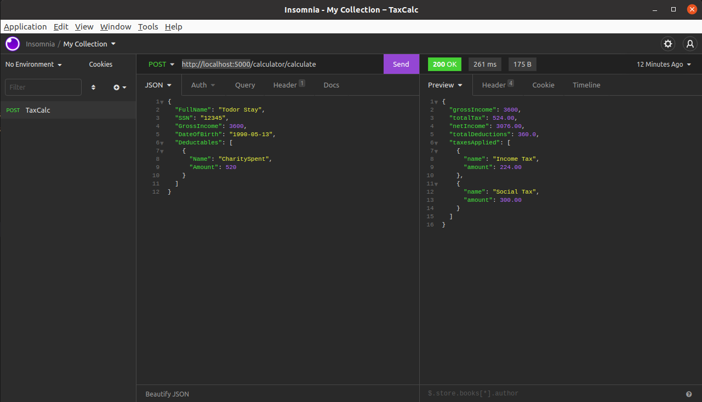

# Tax Calculator WebApi

## Run WebApi

Using dotnet cli -> http://localhost:5000
```
dotnet run --project src/TaxCalculator.WebApi/TaxCalculator.WebApi.csproj
```

OR docker-compose -> http://localhost:8080

```
docker-compose up -d
```
----
## Run Tests

```
dotnet test src/TaxCalculator.Services.Tests/
```
---
## Example API call


----
## Simple Tax Rules

```
Simple Web Api application that calculates net salary given the gross value as
input. The taxation rules in the country of Imaginaria as of date are as follows:

1.) There is no taxation for any amount lower or equal to 1000 Imagiaria Dolars (IDR).

2.) Income tax of 10% is incurred to the excess (amount above 1000).

3.) Social contributions of 15% are expected to be made as well. As for the previous case, the taxable income
is whatever is above 1000 IDR but social contributions never apply to amounts higher than 3000.

4.) CharitySpent – Up to 10% of the gross income are allowed to be spent for charity causes. It then needs to
be subtracted from the gross income base before the taxes are calculated.

Example 1: George has a salary of 980 IDR. He would pay no taxes since this is below the taxation threshold and his
net income is also 980.

Example 2: Irina has a salary of 3400 IDR. She owns income tax: 10% out of 2400 =&gt; 240. Her Social contributions
are 15% out of 2000 =&gt; 300. In total her tax is 540 and she gets to bring home 2860 IDR

Example 3: Mick has salary of 2500 IDR. He has spent 150 IDR on charity causes during the year. His taxable gross
income is 1500 – 150 = 1350 IDR owns income tax: 10% out of 1350 =&gt; 135. His Social contributions are 15% out of
1350 =&gt; 202.5. In total her tax is 337.5 and he gets to bring home 2162.5 IDR

Example 4: Bill has a salary of 3600 IDR. He has spent 520 IDR on charity causes during the year. His taxable gross
income is 3600 – 360 = 3240 IDR owns income tax: 10% out of 2240 =&gt; 224. His Social contributions are 15% out of
2000 =&gt; 300. In total her tax is 524 and she gets to bring home 3076 IDR
```